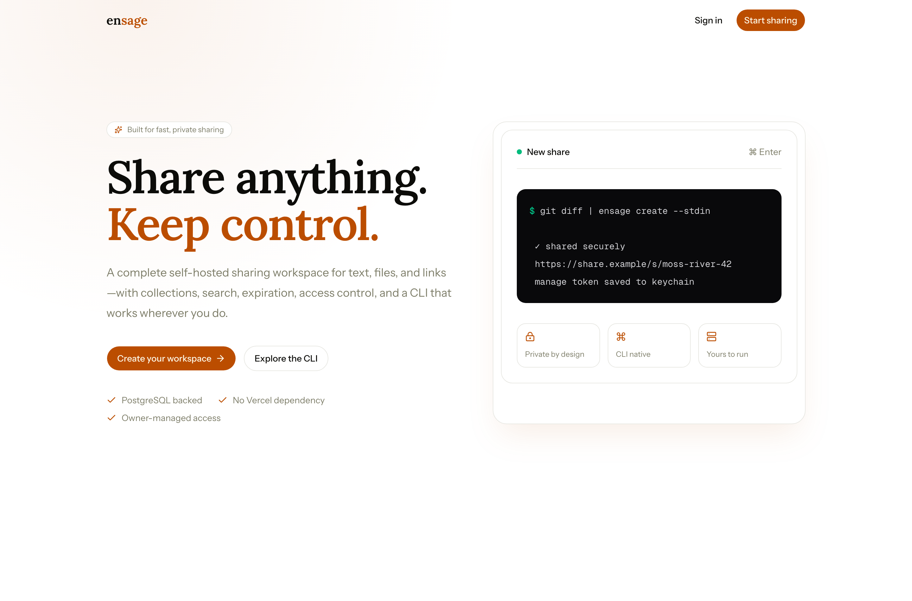

# ensage

<picture>
  <source media="(prefers-color-scheme: dark)" srcset="public/brand/logo-dark.svg">
  
</picture>



A security-first, self-hosted workspace for sharing text, files, and links. ensage
uses Next.js 16, React 19, Clerk, PostgreSQL, Drizzle, shadcn/ui, and local
asynchronous object storage. It has no Vercel runtime dependency.

## Features

- Share text, files, and links with `private`, `unlisted`, or `public` visibility.
- Optional viewer passwords, expiration windows, and one-click link rotation.
- Collections that group related shares and can be published as a set.
- Search across shares and collections, plus a per-workspace activity log.
- REST API and a companion CLI (`ensage`) for terminal workflows.
- Installable PWA with an offline fallback, plus Open Graph metadata, a sitemap,
  and `robots.txt` for search engines.

## Architecture

- Clerk authenticates humans; PostgreSQL stores the local user and authorization model.
- Every query is scoped to an owner. Viewer passwords, API keys, and creator management credentials are separate and stored as Argon2id or SHA-256 digests as appropriate.
- Shares have explicit `pending`, `ready`, `trashed`, and `deleted` states.
- File uploads stream to a temporary object and become visible only after an atomic rename and database transition.
- Rate limits and audit events live in PostgreSQL, so they work across PM2 workers.
- User-configurable defaults and limits live in the Settings page rather than environment files.

## Development

Requirements: Node 26, npm 11, PostgreSQL 18, and a Clerk application.

```bash
npm install
cp .env.example .env.local   # then fill in DATABASE_URL and the Clerk keys
npm run db:migrate
npm run dev                  # http://localhost:3000
```

| Variable                            | Required | Notes                                                       |
| ----------------------------------- | -------- | ----------------------------------------------------------- |
| `DATABASE_URL`                      | yes      | PostgreSQL connection string.                               |
| `CLERK_SECRET_KEY`                  | yes      | Clerk backend key.                                          |
| `NEXT_PUBLIC_CLERK_PUBLISHABLE_KEY` | yes      | Clerk frontend key.                                         |
| `DATABASE_SSL`                      | no       | Set to `true` to require TLS with a trusted certificate.    |
| `DATABASE_POOL_MAX`                 | no       | Connections per process pool. Default 10; total = workers × this. |
| `NEXT_PUBLIC_CLERK_SIGN_IN_URL`     | no       | Defaults to `/sign-in`.                                     |
| `NEXT_PUBLIC_CLERK_SIGN_UP_URL`     | no       | Defaults to `/sign-up`.                                     |
| `PORT`                              | no       | Port for `next start` / the standalone server. Default 3000. |
| `WEB_CONCURRENCY`                   | no       | Number of PM2 cluster workers. Default 1.                   |
| `NEXT_PUBLIC_APP_URL`               | no       | Public origin for canonical/OG URLs and the manifest. Defaults to `https://ensage.shftln.com`. |
| `LOG_LEVEL`                         | no       | `debug`/`info`/`warn`/`error`. Default `info`. Logs are JSON lines. |

Only infrastructure secrets and paths belong in the environment. Product
configuration lives in the app. Do not commit `.env.local`.

### Checks

```bash
npm run typecheck
npm run lint
npm test
```

## CLI

Create an API key in **Settings → API keys** (shown once) and paste it into
`ensage configure`. To mint a key from the server instead, sign in to the app
once so a local user exists and run:

```bash
npm run api-key:create -- --configure --url http://localhost:3000
npm link

ensage list
git diff | ensage create --stdin --title "Review diff" --ttl 24
ensage create --file ./build.log
ensage create --link https://example.com
ensage create --stdin --collection <collection-id> --password s3cret-pass
ensage list --trash
ensage view <share-id>
ensage edit <share-id> --title "New title" --visibility private
ensage rotate <share-id>
ensage trash <share-id>
ensage restore <share-id>
ensage delete <share-id>
```

`--configure` writes the CLI credentials with mode `0600` under
`~/.config/ensage`. To point an existing CLI at a server manually, run
`ensage configure --url … --token ens_…`.

## Production

Run behind a hardened reverse proxy that enforces TLS, request timeouts, and an
infrastructure upload ceiling. Either use Docker Compose or PM2:

```bash
npm ci
npm run db:migrate
npm run build
npm install -g pm2
npm run start:pm2
```

The PM2 setup runs the Next.js server plus a `cleanup` worker that permanently
removes expired, trashed, and deleted shares.
